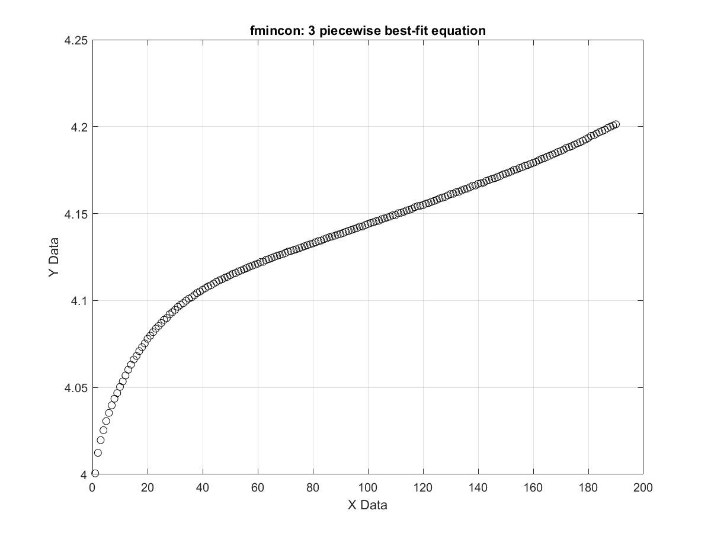
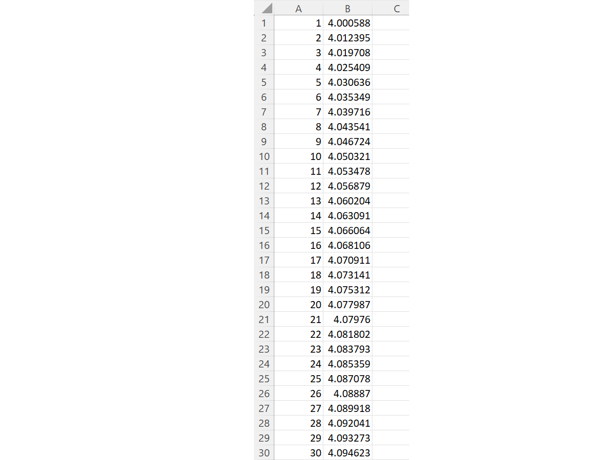
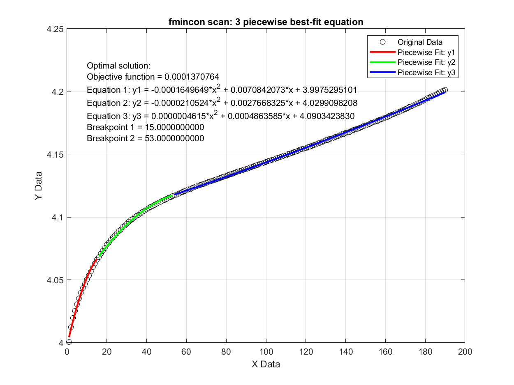

# Piecewise Equation Curve Fitting for Any Dataset

 

- [English](README.md)
- [中文](README.zh-CN.md)

## Overview
This project addresses the limitations of existing curve fitting tools in Excel, Python, and MATLAB. These tools typically do not support piecewise equations curve fitting, and their mathematical models are often limited. This project demonstrates how to fit data using custom mathematical models with multiple piecewise equations.

## Example Dataset
We will use a dataset to demonstrate the fitting process using three piecewise equations, each modeled as a 2nd order polynomial.

<table style="width:100%; text-align:center;">
  <tr>
    <td style="width: 45%;">
      
       
      Figure 1: Local minima solution
    </td>
    <td style="width: 45%;">
      
       
      Figure 2: Global minima solution
    </td>
  </tr>
</table>

### Mathematical Model
In here, we selected 3 piecewise equation and 2nd order polynomial equation to fit the data. However, you may use any number of piecewise equations and any equation combinations you like. 

$$
y(x) =
\begin{cases} 
a_1 x^2 + b_1 x + c_1 & 0 < x < p_1 \\
a_2 x^2 + b_2 x + c_2 & p_1 \leq x \leq p_2 \\
a_3 x^2 + b_3 x + c_3 & p_2 \leq x \leq p_3 \\
\end{cases}
$$

Our goal is to find the optimal coefficients (a1, b1, c1, a2, b2, c2, a3, b3, c3) and breakpoints (p1, p2, p3) to best fit the raw data by minimizing the objective function:

$$
\text{Objective function} = \min \sum_{x = \text{MIN}}^{\text{MAX}} \left( y(x) - \text{raw data } y \right)^2
$$

### Boundary Conditions
- Coefficients: $-10 \leq a_1, b_1, c_1, a_2, b_2, c_2, a_3, b_3, c_3 \leq 10$

- Breakpoints: $10 \leq p_1 < p_2 < p_3 \leq \max(\text{raw data } x)$

### Inequality Constraints
There is no inequality constraint in this example. 

### Equality Constraints
The piecewise equations must be continuous at breakpoints, and their gradients must match:

$$
\begin{aligned}
y_1(x) &= y_2(x) \quad \text{at} \quad x = p_1 \\
y_2(x) &= y_3(x) \quad \text{at} \quad x = p_2 \\
\frac{dy_1}{dx} &= \frac{dy_2}{dx} \quad \text{at} \quad x = p_1 \\
\frac{dy_2}{dx} &= \frac{dy_3}{dx} \quad \text{at} \quad x = p_2
\end{aligned}
$$

### Gradient Equations
The gradient equations for the piecewise model are:

$$
\frac{dy}{dx} =
\begin{cases}
2 a_1 x + b_1 & \text{for } 0 < x < p_1 \\
2 a_2 x + b_2 & \text{for } p_1 \leq x \leq p_2 \\
2 a_3 x + b_3 & \text{for } p_2 \leq x \leq p_3
\end{cases}
$$

## Solution 1: Local Optimization with `fmincon()`

**Local Optimization Code:** `find_best_fit_3piecewise_equ_fmincon_local.m`

MATLAB's `fmincon()` function in the Optimization Toolbox can find a local minimum solution for system optimization problems. It supports multiple algorithms such as:
- 'interior-point' (default)
- 'trust-region-reflective'
- 'sqp'
- 'sqp-legacy'
- 'active-set'

However, a local minima usually is not the most optimal solution (called global minima). This is because of the gradient descent algorithm could stuck at the local minima and stop iteration. 

## Solution 2: Global Optimization with `fmincon()`

**Global Optimization Code:** `find_best_fit_3piecewise_equ_fmincon_global.m`

Improvements over solution 1 ensure finding a global minimum solution.

## Curve Fitting Results
### Visual Results
As we can see, the global minima solution (right) has better curve fitting result than local minima solution (left). 

<table style="width:100%; text-align:center;">
  <tr>
    <td style="width: 45%;">
      
       
      Figure 1: Local minima solution
    </td>
    <td style="width: 45%;">
      
       
      Figure 2: Global minima solution
    </td>
  </tr>
</table>

### Numerical Results
The numerical results are given below. Note that everything you run the code, the result will be slightly different. This is due to the nature behind machine learning and system optimization algorithm, which is the probability. However, the result should NOT vary too much. 

As you can see, the objective function value at global minima is much less than the local minima. It approves that the curve fitting result is better. 

|                       | Local Minima                                                | Global Minima                                              |
|-----------------------|-------------------------------------------------------------|------------------------------------------------------------|
| Method                | Final Objective Function Value                              | Final Objective Function Value                             |
| Equation 1            | y1 = -0.0000224932*x^2 + 0.0031112500*x + 4.0187622232       | y1 = -0.0001649649*x^2 + 0.0070842073*x + 3.9975295101      |
| Equation 2            | y2 = 0.0000025373*x^2 + 0.0000485654*x + 4.1124484546       | y2 = -0.0000210524*x^2 + 0.0027668325*x + 4.0299098208      |
| Equation 3            | y3 = 0.0000002261*x^2 + 0.0005712989*x + 4.0828909146       | y3 = 0.0000004615*x^2 + 0.0004863585*x + 4.0903423830       |
| Breakpoint 1          | 61.17915627                                                 | 15                                                         |
| Breakpoint 2          | 113.0883872                                                 | 53                                                         |

## How to Use the Code
To find the most suitable piecewise curve fitting model, follow these steps:
1. Decide the number of piecewise equations.
2. Select a suitable mathematical model.
3. Set the lower and upper boundary conditions for all coefficients and breakpoints.
4. Choose an appropriate step size for breakpoints (smaller step size increases computational time).
5. Run the code with different combinations and compare the final objective function results.

I tried 4 combinations and their result table:

- **a.** 2 piecewise equation, local minima: [find_best_fit_2piecewise_equ_fmincon_local.m](path/to/2_piecewise_equ_local_min_script.m)
- **b.** 2 piecewise equation, global minima: [find_best_fit_2piecewise_equ_fmincon_global.m](path/to/2_piecewise_equ_global_min_script.m)
- **c.** 3 piecewise equation, local minima: [find_best_fit_3piecewise_equ_fmincon_local.m](path/to/3_piecewise_equ_local_min_script.m)
- **d.** 3 piecewise equation, global minima: [find_best_fit_3piecewise_equ_fmincon_global.m](path/to/3_piecewise_equ_global_min_script.m)

It’s obvious to see that 3 piecewise equation with global minima has the minimum objective function, which means the curving fitting is most accurate. Meanwhile, there is no over-fitting issue by visual inspection.

### Combination Results
| Method | Final Objective Function Value | Equation 1 | Equation 2 | Equation 3 | Breakpoint 1 | Breakpoint 2 |
| ------ | ----------------------------- | ---------- | ---------- | ---------- | ------------ | ------------ |
| 2 Piecewise Local Minima | 0.000678959 | y1 = -0.0000624627*x^2 + 0.0049620077*x + 4.0058089647 | y2 = -0.0000000150*x^2 + 0.0006255810*x + 4.0810903548 | / | 34.72042092 | / |
| 2 Piecewise Global Minima | 0.000522159 | y1 = -0.0000472164*x^2 + 0.0043732929*x + 4.0085296766 | y2 = 0.0000000510*x^2 + 0.0005919077*x + 4.0841573823 | / | 40 | / |
| 3 Piecewise Local Minima | 0.001538723 | y1 = -0.0000224932*x^2 + 0.0031112500*x + 4.0187622232 | y2 = 0.0000025373*x^2 + 0.0000485654*x + 4.1124484546 | y3 = 0.0000002261*x^2 + 0.0005712989*x + 4.0828909146 | 61.17915627 | 113.0883872 |
| 3 Piecewise Global Minima | 0.000137076 | y1 = -0.0001649649*x^2 + 0.0070842073*x + 3.9975295101 | y2 = -0.0000210524*x^2 + 0.0027668325*x + 4.0299098208 | y3 = 0.0000004615*x^2 + 0.0004863585*x + 4.0903423830 | 15 | 53 |

