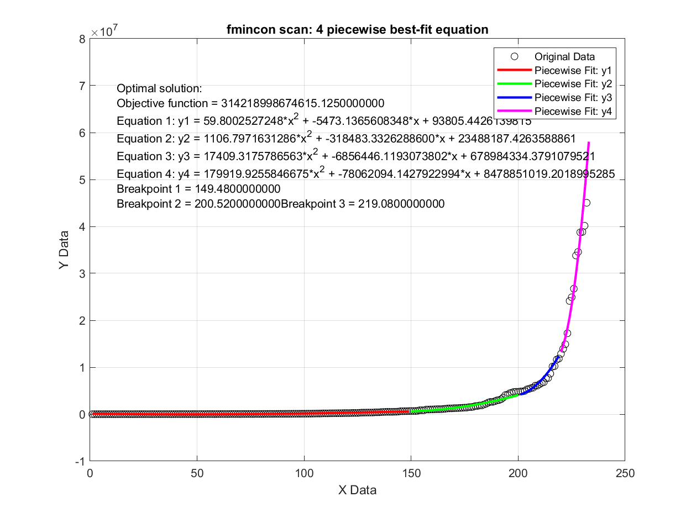

# 分段函数曲线拟合方法

 

- [English](README.md)
- [中文](README.zh-CN.md)

## 概述
本项目解决了Excel、Python和MATLAB中现有曲线拟合工具的局限性。这些工具通常不支持分段函数曲线拟合，其数学模型也往往有限。本项目展示了如何使用多个分段函数和自定义数学模型来拟合数据。

## 示例数据集
我们将使用Excel dataset1数据集来演示使用3分段函数进行拟合的过程，每个分段函数均为2次多项式。

<table style="width:100%; text-align:center;">
  <tr>
    <td style="width: 45%;">
      
       
      图1：局部最优解
    </td>
    <td style="width: 45%;">
      
       
      图2：全局最优解
    </td>
  </tr>
</table>

### 数学模型
在这里，我们选择了3个分段函数和2次多项式方程来拟合数据。当然，您可以使用任意数量的分段函数和任意方程组合。

$$
y(x) =
\begin{cases} 
a_1 x^2 + b_1 x + c_1 & 0 < x < p_1 \\
a_2 x^2 + b_2 x + c_2 & p_1 \leq x \leq p_2 \\
a_3 x^2 + b_3 x + c_3 & p_2 \leq x \leq p_3 \\
\end{cases}
$$

我们的目标是找到最佳系数(a1, b1, c1, a2, b2, c2, a3, b3, c3)和断点(p1, p2, p3)，以通过最小化目标函数来最佳拟合原始数据：

$$
\text{目标函数} = \min \sum_{x = \text{MIN}}^{\text{MAX}} \left( y(x) - \text{原始数据} y \right)^2
$$

### 边界条件
- 系数: $-10 \leq a_1, b_1, c_1, a_2, b_2, c_2, a_3, b_3, c_3 \leq 10$
- 断点: $10 \leq p_1 < p_2 < p_3 \leq \max(\text{原始数据} x)$

### 不等式约束
此示例中没有不等式约束。

### 等式约束
分段函数在断点处必须连续，其梯度必须匹配：

$$
\begin{aligned}
y_1(x) &= y_2(x) \quad \text{在} \quad x = p_1 \\
y_2(x) &= y_3(x) \quad \text{在} \quad x = p_2 \\
\frac{dy_1}{dx} &= \frac{dy_2}{dx} \quad \text{在} \quad x = p_1 \\
\frac{dy_2}{dx} &= \frac{dy_3}{dx} \quad \text{在} \quad x = p_2
\end{aligned}
$$

### 梯度方程
分段函数的梯度方程为：

$$
\frac{dy}{dx} =
\begin{cases}
2 a_1 x + b_1 & \text{对于} 0 < x < p_1 \\
2 a_2 x + b_2 & \text{对于} p_1 \leq x \leq p_2 \\
2 a_3 x + b_3 & \text{对于} p_2 \leq x \leq p_3
\end{cases}
$$

## 解决方案1：使用 `fmincon()` 进行局部优化

**局部优化代码:** [find_best_fit_3piecewise_equ_fmincon_local.m](MATLAB_scripts/find_best_fit_3piecewise_equ_fmincon_local.m)

MATLAB的 `fmincon()` 函数在优化工具箱中可以找到系统优化问题的局部最优解。它支持多种算法，例如：
- 'interior-point' (默认)
- 'trust-region-reflective'
- 'sqp'
- 'sqp-legacy'
- 'active-set'

然而，局部最优解通常不是最优解，这是因为梯度下降算法可能会停留在局部最优解处并停止迭代。

## 解决方案2：使用 `fmincon()` 进行全局优化

**全局优化代码:** [find_best_fit_3piecewise_equ_fmincon_global.m](MATLAB_scripts/find_best_fit_3piecewise_equ_fmincon_global.m)

改进了方案1，确保找到全局最优解。

## 曲线拟合结果
### 视觉结果
如图所示，全局最优解（右侧）的曲线拟合结果，要优于局部最优解（左侧）。

<table style="width:100%; text-align:center;">
  <tr>
    <td style="width: 50%;">
      
       
      
图3：3段，局部最优解

    </td>
    <td style="width: 50%;">
      
       
      
图4：3段，全局最优解

    </td>
  </tr>
</table>

### 数值结果
下面给出了数值结果。请注意，每次运行代码时，结果会略有不同。这是由于机器学习和系统优化算法背后的概率性质。然而，结果不应有太大变化。

如您所见，全局最优解处的目标函数值远小于局部最优解。这证明了曲线拟合结果更好。

|                       | 局部最优解                                                  | 全局最优解                                                  |
|-----------------------|-------------------------------------------------------------|-------------------------------------------------------------|
| 最终目标函数值                  | 0.001538723                                              |   0.000137076                                            |
| 方程1                 | y1 = -0.0000224932*x^2 + 0.0031112500*x + 4.0187622232       | y1 = -0.0001649649*x^2 + 0.0070842073*x + 3.9975295101       |
| 方程2                 | y2 = 0.0000025373*x^2 + 0.0000485654*x + 4.1124484546       | y2 = -0.0000210524*x^2 + 0.0027668325*x + 4.0299098208       |
| 方程3                 | y3 = 0.0000002261*x^2 + 0.0005712989*x + 4.0828909146       | y3 = 0.0000004615*x^2 + 0.0004863585*x + 4.0903423830       |
| 断点1                 | 61.17915627                                                 | 15                                                          |
| 断点2                 | 113.0883872                                                 | 53                                                          |

## 如何使用代码

要找到最合适的分段曲线拟合模型，请按照以下步骤操作：

1. 确定分段函数的数量。
2. 选择合适的数学模型。
3. 设置所有系数和断点的下限和上限条件。
4. 选择适当的断点步长（较小的步长会增加计算时间，但是会增加精确度）。
5. 运行代码，尝试不同的组合，并选取最小的目标函数结果。

我尝试了4种组合，并列出了它们的结果表格：

- **a.** 2个分段函数，局部最优解：[find_best_fit_2piecewise_equ_fmincon_local.m](MATLAB_scripts/2_piecewise_equ_local_min_script.m)
- **b.** 2个分段函数，全局最优解：[find_best_fit_2piecewise_equ_fmincon_global.m](MATLAB_scripts/2_piecewise_equ_global_min_script.m)
- **c.** 3个分段函数，局部最优解：[find_best_fit_3piecewise_equ_fmincon_local.m](MATLAB_scripts/3_piecewise_equ_local_min_script.m)
- **d.** 3个分段函数，全局最优解：[find_best_fit_3piecewise_equ_fmincon_global.m](MATLAB_scripts/3_piecewise_equ_global_min_script.m)

显然可以看出，具有全局最优解的3个分段函数具有最小的目标函数值，这意味着曲线拟合最准确。同时，通过视觉检查没有过拟合问题。

<table style="width:100%; text-align:center;">
  <tr>
    <td style="width: 50%;">
      
       
      
图5：2段，局部最优解

    </td>
    <td style="width: 50%;">
      
       
      
图6：2段，全局最优解

    </td>
  </tr>
  <tr>
    <td style="width: 50%;">
      
       
      
图7：3段，局部最优解

    </td>
    <td style="width: 50%;">
      
       
      
图8：3段，全局最优解

    </td>
  </tr>
</table>

| 方法                    | 2分段函数  局部最优解 | 2分段函数  全局最优解 | 3分段函数  局部最优解 | 3分段函数  全局最优解 |
| ----------------------- | ------------------------ | ------------------------ | ------------------------ | ------------------------ |
| 最终目标函数值           | 0.000678959              | 0.000522159              | 0.001538723              | 0.000137076              |
| 方程1                    | y1 = -0.0000624627*x^2 + 0.0049620077*x + 4.0058089647 | y1 = -0.0000472164*x^2 + 0.0043732929*x + 4.0085296766 | y1 = -0.0000224932*x^2 + 0.0031112500*x + 4.0187622232 | y1 = -0.0001649649*x^2 + 0.0070842073*x + 3.9975295101 |
| 方程2                    | y2 = -0.0000000150*x^2 + 0.0006255810*x + 4.0810903548 | y2 = 0.0000000510*x^2 + 0.0005919077*x + 4.0841573823 | y2 = 0.0000025373*x^2 + 0.0000485654*x + 4.1124484546 | y2 = -0.0000210524*x^2 + 0.0027668325*x + 4.0299098208 |
| 方程3                    | /                        | /                        | y3 = 0.0000002261*x^2 + 0.0005712989*x + 4.0828909146 | y3 = 0.0000004615*x^2 + 0.0004863585*x + 4.0903423830 |
| 断点1                    | 34.72042092              | 40                       | 61.17915627              | 15                       |
| 断点2                    | /                        | /                        | 113.0883872              | 53                       |

## 作业
请自行尝试数Excel dataset2和dataset3。对于数据集2，我的结果如下：

<table style="width:100%; text-align:center;">
  <tr>
    <td style="width: 100%;">
      
       
      
图9：4个分段函数，全局最优解

    </td>
  </tr>
</table>

## 联系我们

  

    <ul style="list-style-type: disc; padding-left: 20px; margin: 0;">
      <li><strong>公司官网：</strong> <a href="https://altita-tech.com/">https://altita-tech.com/</a></li>
      <li><strong>销售：</strong> <a href="mailto:sales@altita-tech.com">sales@altita-tech.com</a></li>
      <li><strong>技术支持：</strong> <a href="mailto:tech@altita-tech.com">tech@altita-tech.com</a></li>
    </ul>
  

<table style="width:100%; text-align:center;">
  <tr>
    <td style="width: 100%;">
      
    </td>
  </tr>
</table>
